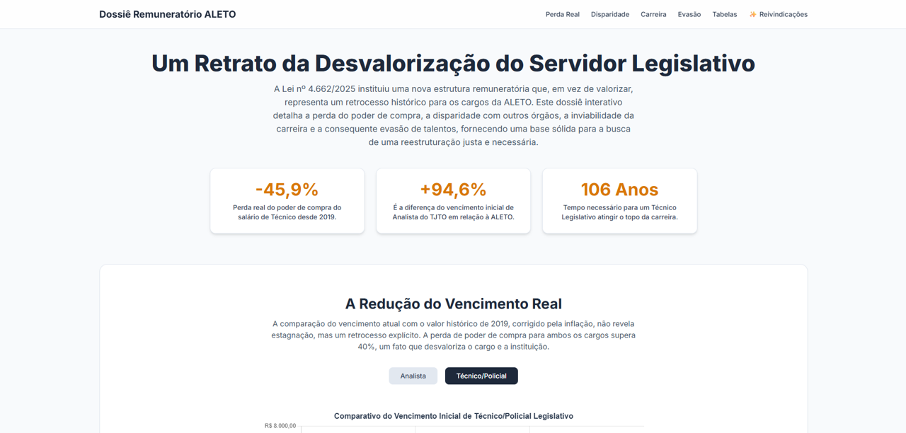

<a name="readme-top"></a>

<div align="center">
  
  [![Contributors][contributors-shield]][contributors-url]
  [![Forks][forks-shield]][forks-url]
  [![Stargazers][stars-shield]][stars-url]
  [![Issues][issues-shield]][issues-url]
  [![MIT License][license-shield]][license-url]
  
</div>
<br />
<div align="center">
  <a href="https://github.com/voaneves/salarioaleto">
        
  </a>
  <h3 align="center">📊 Dossiê Interativo: Análise da Remuneração na ALETO</h3>
  <p align="center">
    Análise de dados 📈, comparativos e assistente IA ✨ para apoiar a valorização dos servidores da Assembleia Legislativa do Tocantins.
    <br />
    <a href="https://github.com/voaneves/salarioaleto"><strong>Explore o código-fonte »</strong></a>
    <br />
    <br />
    <a href="https://voaneves.com/salarioaleto/"><strong>Visite o Site »</strong></a>
    <br>
    <a href="https://github.com/voaneves/salarioaleto/issues">Reporte um Bug</a>
    ·
    <a href="https://github.com/voaneves/salarioaleto/issues">Sugira uma Funcionalidade</a>
  </p>
</div>

<details>
  <summary>Índice</summary>
  <ol>
    <li>
      <a href="#sobre-o-projeto">Sobre o Projeto</a>
      <ul>
        <li><a href="#tecnologias-utilizadas">Tecnologias Utilizadas</a></li>
      </ul>
    </li>
    <li><a href="#funcionalidades-principais">Funcionalidades Principais</a></li>
    <li><a href="#como-começar">Como Começar</a></li>
    <li><a href="#processo-de-deploy">Processo de Deploy</a></li>
    <li><a href="#contribuindo">Contribuindo</a></li>
    <li><a href="#licença">Licença</a></li>
    <li><a href="#contato">Contato</a></li>
    <li><a href="#agradecimentos">Agradecimentos</a></li>
  </ol>
</details>

## Sobre o Projeto

Este projeto é um dossiê digital interativo, construído como uma Single-Page Application (SPA), para analisar e expor a situação remuneratória dos servidores da Assembleia Legislativa do Estado do Tocantins (ALETO). O objetivo é traduzir dados complexos de planilhas e relatórios em uma narrativa visual e de fácil compreensão, servindo como uma ferramenta robusta para as reivindicações do Sindicato dos Servidores (Sindilegis-TO).

A página guia o usuário através de uma análise completa, abordando a perda histórica do poder de compra, a disparidade salarial com outros órgãos do estado, a inviabilidade do plano de carreira e as consequências reais, como a evasão de talentos.

<div align="center">
  <a href="https://voaneves.com/salarioaleto/">
    
  </a>
</div>
<p align="center"><i>Screenshot da página inicial do projeto.</i></p>

<p align="right">(<a href="#readme-top">voltar ao topo</a>)</p>

### Tecnologias Utilizadas

Este projeto foi construído com tecnologias web modernas, focando na simplicidade, performance e facilidade de manutenção, sendo inteiramente contido em um único ficheiro HTML.

* [![HTML5][HTML5-shield]][HTML5-url]
* [![TailwindCSS][TailwindCSS.com]][TailwindCSS-url]
* [![JavaScript][JavaScript-shield]][JavaScript-url]
* [![ChartJS][ChartJS-shield]][ChartJS-url]

<p align="right">(<a href="#readme-top">voltar ao topo</a>)</p>

## Funcionalidades Principais

-   **Visualização de Dados Interativa:** Gráficos dinâmicos que permitem comparar a evolução salarial e a disparidade entre órgãos.
-   **Análise Comparativa Detalhada:** Tabelas interativas com abas para comparar as estruturas de carreira completas, incluindo o percentual de diferença em relação à ALETO.
-   **Assistente com IA (Gemini):** Funcionalidade que gera minutas de ofícios e requerimentos com base nas reivindicações, transformando análise em ação imediata.
-   **Base Documental:** Galeria com imagens de publicações do Diário Oficial que comprovam a evasão de talentos.
-   **Design Totalmente Responsivo:** A interface se adapta perfeitamente a qualquer dispositivo, de smartphones a desktops.
-   **Ficheiro Único:** Todo o projeto está contido em um único ficheiro `index.html`, facilitando o compartilhamento e o deploy.

<p align="right">(<a href="#readme-top">voltar ao topo</a>)</p>

## Como Começar

Como este é um projeto autocontido, não há necessidade de instalação de dependências ou processos de build.

1.  Clone o repositório para sua máquina local.
    ```sh
    git clone [https://github.com/voaneves/salarioaleto.git](https://github.com/voaneves/salarioaleto.git)
    ```
2.  Navegue até o diretório do projeto.
    ```sh
    cd salarioaleto
    ```
3.  Abra o ficheiro `index.html` diretamente no seu navegador de preferência.

<p align="right">(<a href="#readme-top">voltar ao topo</a>)</p>

## Processo de Deploy

O deploy deste projeto no GitHub Pages é extremamente simples:

1.  **Crie o Repositório:** Crie um novo repositório público no GitHub (ex: `salarioaleto`).
2.  **Envie o Ficheiro:** Faça o upload do ficheiro `index.html` para a raiz do repositório.
3.  **Ative o GitHub Pages:**
    * Vá para a aba "Settings" (Configurações) do seu repositório.
    * No menu lateral, clique em "Pages".
    * Na seção "Branch", selecione `main` (ou `master`), deixe a pasta como `/root` e clique em "Save".
4.  **Pronto!** Após alguns minutos, seu site estará disponível no endereço `https://voaneves.com/salarioaleto/`.

<p align="right">(<a href="#readme-top">voltar ao topo</a>)</p>

## Contribuindo

Contribuições são o que tornam a comunidade de código aberto um lugar incrível para aprender, inspirar e criar. Qualquer contribuição que você fizer será **muito apreciada**.

Se você tiver uma sugestão para melhorar o projeto, por favor, faça um fork do repositório e crie um pull request. Você também pode simplesmente abrir uma issue com a tag "enhancement".
Não se esqueça de dar uma estrela ao projeto! Obrigado!

1.  Faça um Fork do Projeto
2.  Crie sua Feature Branch (`git checkout -b feature/AmazingFeature`)
3.  Faça o Commit de suas alterações (`git commit -m 'Add some AmazingFeature'`)
4.  Faça o Push para a Branch (`git push origin feature/AmazingFeature`)
5.  Abra um Pull Request

<p align="right">(<a href="#readme-top">voltar ao topo</a>)</p>

## Licença

Distribuído sob a Licença MIT. Veja `LICENSE.txt` para mais informações.

<p align="right">(<a href="#readme-top">voltar ao topo</a>)</p>

## Contato

Seu Nome - [@seu_twitter](https://twitter.com/seu_twitter) - email@exemplo.com

Link do Projeto: [https://github.com/voaneves/salarioaleto](https://github.com/voaneves/salarioaleto)

<p align="right">(<a href="#readme-top">voltar ao topo</a>)</p>

## Agradecimentos

Gostaria de agradecer às seguintes ferramentas e comunidades que tornaram este projeto possível:

* [Tailwind CSS](https://tailwindcss.com/)
* [Chart.js](https://www.chartjs.org/)
* [Google Gemini](https://gemini.google.com/)
* [GitHub Pages](https://pages.github.com/)
* [Img Shields](https://shields.io)

<p align="right">(<a href="#readme-top">voltar ao topo</a>)</p>

<!-- MARKDOWN LINKS & IMAGES -->
[contributors-shield]: https://img.shields.io/github/contributors/voaneves/salarioaleto.svg?style=for-the-badge
[contributors-url]: https://github.com/voaneves/salarioaleto/graphs/contributors
[forks-shield]: https://img.shields.io/github/forks/voaneves/salarioaleto.svg?style=for-the-badge
[forks-url]: https://github.com/voaneves/salarioaleto/network/members
[stars-shield]: https://img.shields.io/github/stars/voaneves/salarioaleto.svg?style=for-the-badge
[stars-url]: https://github.com/voaneves/salarioaleto/stargazers
[issues-shield]: https://img.shields.io/github/issues/voaneves/salarioaleto.svg?style=for-the-badge
[issues-url]: https://github.com/voaneves/salarioaleto/issues
[license-shield]: https://img.shields.io/github/license/voaneves/salarioaleto.svg?style=for-the-badge
[license-url]: https://github.com/voaneves/salarioaleto/blob/main/LICENSE.txt
[HTML5-shield]: https://img.shields.io/badge/HTML5-E34F26?style=for-the-badge&logo=html5&logoColor=white
[HTML5-url]: https://developer.mozilla.org/pt-BR/docs/Web/HTML
[TailwindCSS.com]: https://img.shields.io/badge/Tailwind_CSS-06B6D4?style=for-the-badge&logo=tailwindcss&logoColor=white
[TailwindCSS-url]: https://tailwindcss.com/
[JavaScript-shield]: https://img.shields.io/badge/JavaScript-F7DF1E?style=for-the-badge&logo=javascript&logoColor=black
[JavaScript-url]: https://developer.mozilla.org/pt-BR/docs/Web/JavaScript
[ChartJS-shield]: https://img.shields.io/badge/Chart.js-FF6384?style=for-the-badge&logo=chartdotjs&logoColor=white
[ChartJS-url]: https://www.chartjs.org/
